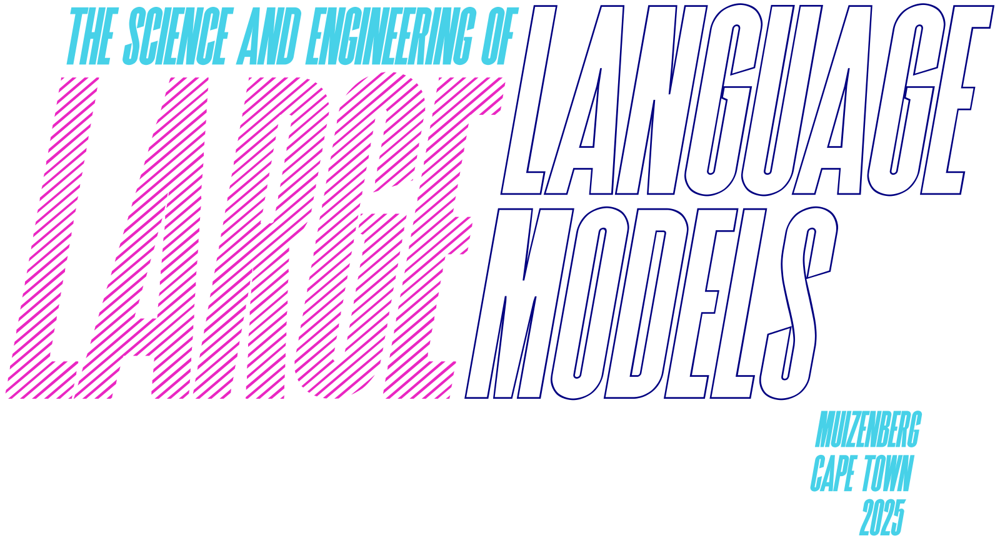

# The Science and Engineering of Large Language Models (AIMS 2025)

**A community-driven repository for the workshop held at the African Institute for Mathematical Sciences (AIMS) in Muizenberg, Cape Town, from March 31 to April 11, 2025.**

This repository contains lecture slides, lab notebooks, additional resources, and community notes for the "Science and Engineering of Large Language Models" workshop.

> The goal of the course -- apart from upskilling you to the forefront of LLM work -- is to allow different graduate students to get trained together, to work together, to socialize together, and to get to know each other across university boundaries.
>
> — *Ulrich Paquet, Director of AIMS*

---

## Table of Contents

- [Workshop Schedule](#workshop-schedule)
- [Assignments](#assignments)
- [Daily Materials & Lectures](#daily-materials--lectures)
- [Essential Resources](#essential-resources)
- [How to Contribute](#how-to-contribute)

---

## Workshop Schedule

A high-level overview of the topics covered. For full details, see the [**Official PDF Schedule**](./schedule/workshop_schedule.pdf).

---

## Assignments

### Assignment 1 (Due Week 1)

As explained by Amr Khalifa, you can choose one or both of the following tasks. A bonus is awarded for completing both.

1.  **Theoretical Assignment:**
    -   **[assignment_1_theoretical.pdf](./assignments/assignment_1_theoretical.pdf)**

2.  **Practical Assignment:** Convert the GPT-2 style transformer from the lab into a Llama-like architecture.
    -   **[assignment_1_practical_GPT-to-Llama.ipynb](./assignments/assignment_1_practical_GPT-to-Llama.ipynb)**
    -   **Key Changes Required:**
        1.  Implement **RMS Norm** instead of Layer Norm (both pre and post-normalization).
        2.  Implement the **Gated MLP (SiLU/SwiGLU)** layer instead of the standard GELU activation.
    -   **Recommended Reading:** [Llama 3 Architecture in JAX/Flax](https://saurabhalone.com/blogs/llama3/web)

---

## Daily Materials & Lectures

### Day 1: Monday, 31 March
*Topics: A Brief History of LLMs, Tokenization*
*   **Lab:** Building a Transformer from Scratch (student version)
    -   **[Notebook](./Day_01_Intro_and_Tokenization/lab_build_a_transformer.ipynb)**
    -    <!-- TODO: Replace with your username and repo name! -->

### Day 2: Tuesday, 1 April
*Topics: The Transformer Architecture (Deep Dive)*
*   *Materials from this day are foundational for the practical part of Assignment 1.*

### Day 3: Wednesday, 2 April
*Topics: Mixture of Experts (MoE), Diloco*
*   **Lecture Slides:**
    -   [Mixture of Experts (MoE)](./Day_03_Advanced_Architectures/slides_Mixture_of_Experts_Rusu.pdf) by Andrei Rusu
    -   [Diloco](./Day_03_Advanced_Architectures/slides_Diloco_Rusu.pdf) by Andrei Rusu

### Day 4: Thursday, 3 April
*Topics: Scaling Laws, Optimizers, Training Dynamics, Single GPU Performance*
*   **Lecture Slides:**
    -   [Optimizers and Training Dynamics](./Day_04_Training_and_Optimization/slides_Optimizers_and_Dynamics_Ciuca.pptx) by Razvan Ciuca
*   **Labs & Code:**
    -   [Optimizers Lab (No Solutions)](./Day_04_Training_and_Optimization/lab_optimizers_no_solutions.ipynb)
    -   [Scaling Laws Practical](https://colab.research.google.com/drive/1FSGEQye3O5I3V20DF-4qk1sPRXwNstXb?usp=sharing) (Colab Link)
    -   [Optimized Transformer in JAX/Flax](./Day_04_Training_and_Optimization/code_optimized_transformer_jax.ipynb) by Amr Khalifa
*   **Special Session:** AI Safety and AGI Discussion with Razvan Ciuca
    -   [Link to Discussion Slides](https://docs.google.com/presentation/d/1CsxC3H2lYw3F2cADENblr7Guti0Y5Z61yqMSW_e33b4/edit?usp=sharing)
    -   *Key Topics: Definitions of AGI, the power of language vs. embodiment, causality, existential risk, and the physical limits of computation.*

### Day 5: Friday, 4 April
*Topics: Sparsity, Quantization, Adaptors (LoRA)*
*   **Lecture Slides:**
    -   [Sparsity, Quantization & PEFT](./Day_05_Efficiency_and_Adaptation/slides_Sparsity_Quantization_PEFT_Evci.pdf) by Utku Evci
*   **Labs:**
    -   [Quantization & Sparsity Lab](https://colab.research.google.com/drive/139pba-qNatuB4kW7TDmPY7sVk_MtkXp4?usp=sharing) (Colab Link)
    -   [Quantized Transformer Lab](https://colab.research.google.com/drive/1hLB_kzUvkyNFdQU15FkLdJnXE4cFAPUS?usp=sharing) (Colab Link)
    -   [LoRA from Scratch](./Day_05_Efficiency_and_Adaptation/lab_lora_from_scratch.ipynb) by Dereck

### Day 7: Monday, 7 April
*Topics: Post-training, Instruction Tuning, Chain-of-Thought (CoT)*
*   **Lecture Slides:**
    -   [Instruction Tuning](./Day_07_Post_Training_Instruction_Tuning/slides_Instruction_Tuning_Singh.pdf) by Jerry Singh
    -   [Emergent Abilities & CoT](./Day_07_Post_Training_Instruction_Tuning/slides_Emergent_Abilities_and_CoT_Singh.pdf) by Jerry Singh

### Day 8: Tuesday, 8 April
*Topics: Scaling LLMs, Roofline Models, Profiling, RLHF Introduction*
*   **Lecture Slides:**
    -   [Post Training: Alignment and RLHF (Part 1)](./Day_08_Scaling_and_Alignment_Part1/slides_RLHF_Part1_Comanici.pdf) by Gheorghe Comanici
*   **Labs:**
    -   [Scaling Lab: Rooflines & Profiling](./Day_08_Scaling_and_Alignment_Part1/lab_scaling_rooflines_and_profiling.ipynb)
    -   [RLHF Part 1 Lab](https://colab.research.google.com/drive/1bcDAkaAlzeQ0_C9VXS5xurKhe03iPo8_?usp=sharing) (Colab Link)

### Day 9: Wednesday, 9 April
*Topics: Sharded Matmuls, RLHF/DPO*
*   **Lecture Slides:**
    -   [Post Training: Reward Models, DPO, Constitutional AI (Part 2)](./Day_09_Scaling_and_Alignment_Part2/slides_RLHF_Part2_Comanici.pdf) by Gheorghe Comanici
*   **Labs:**
    -   [Sharding Lab](https://colab.research.google.com/drive/1p8bgzfzqh516F1_grWwFEMQTtI7fbxB2?usp=sharing) (Colab Link)
    -   [RLHF Lab 2: Reward Models](https://colab.research.google.com/drive/1eeg_Bn3ONnAVPblLFN0OrSZIHCewtG-F?usp=sharing) (Colab Link)
    -   [DPO Lab](https://colab.research.google.com/drive/1yY0xMUQtMim2tsOlwGTn4vlZdn3MlDHM?usp=sharing) (Colab Link)

### Day 10: Thursday, 10 April
*Topics: Scaling Systems for LLMs (Full)*
*   **Lecture Slides:**
    -   [Scaling Systems for LLMs (Full Deck)](./Day_10_Scaling_Systems/slides_Scaling_Systems_for_LLMs_Full_Rrustemi.pdf) by Alban Rrustemi

---

## Essential Resources

### Foundational Concepts & Building LLMs
*   **Book:** [Build a Large Language Model (from Scratch)](https://www.manning.com/books/build-a-large-language-model-from-scratch) by Sebastian Raschka
*   **PyTorch Playlist:** [Video series that complements the book](https://www.youtube.com/playlist?list=PLTKMiZHVd_2IIEsoJrWACkIxLRdfMlw11)

### Deep Learning Theory & Math
*   **Deep Learning Book:** by Goodfellow, Bengio, and Courville - [www.deeplearningbook.org](https://www.deeplearningbook.org/)
*   **Probabilistic Machine Learning:** by Kevin Murphy - [Book 1 (Intro)](https://probml.github.io/pml-book/book1.html) & [Book 2 (Advanced)](https://probml.github.io/pml-book/book2.html)

### Visualizations & Intuition
*   **3Blue1Brown - Attention:** [Excellent visualizations for core concepts](https://youtube.com/playlist?list=PLZHQObOWTQDNU6R1_67000Dx_ZCJB-3pi&si=9EKPbNdknD_dwhde) (recommended from video #5 onwards).
*   **Attention Video:** [A highly-praised video explaining the attention mechanism](https://youtu.be/-9vVhYEXeyQ).

### Other Courses & Practicals
*   **Stanford CS224n:** [Course on NLP with Deep Learning](https://www.youtube.com/playlist?list=PLoROMvodv4rOhcuXMZkNm7j3fVwBBY42z).
*   **Deep Learning Indaba Practicals:** [JAX Intro](https://github.com/deep-learning-indaba/indaba-pracs-2023/blob/main/jax_intro/README.md) & [Foundations of LLMs](https://github.com/deep-learning-indaba/indaba-pracs-2023/blob/main/foundations_of_llms/README.md).

---

## How to Contribute

This is a repository for all attendees. If you have notes, find a typo, or want to add a resource, please feel free to open an Issue or submit a Pull Request!

---
