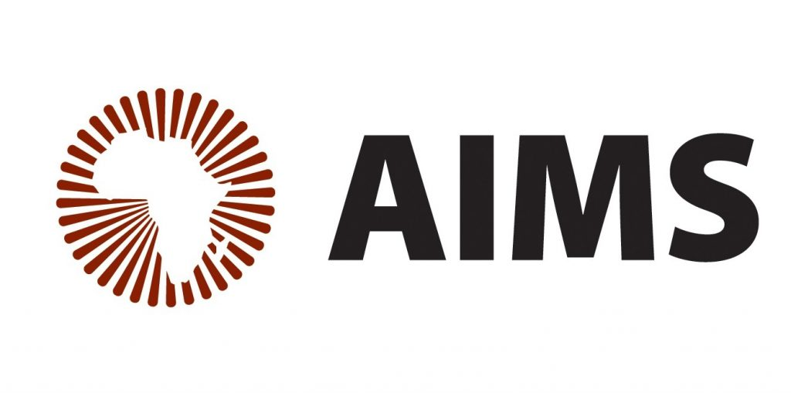

# The Science and Engineering of Large Language Models (AIMS 2025)

**A community-driven repository for the workshop held at the African Institute for Mathematical Sciences (AIMS) in Muizenberg, Cape Town, from March 31 to April 11, 2025.**

This repository contains lecture slides, lab notebooks, additional resources, and community notes for the "Science and Engineering of Large Language Models" workshop. It is intended to be a collaborative space for the 62 graduate students attending from across South Africa and Africa.

> The goal of the course -- apart from upskilling you to the forefront of LLM work -- is to allow different graduate students to get trained together, to work together, to socialize together, and to get to know each other across university boundaries. One day, some of you might venture into start-up land, or might write collaborative research papers, and it's in a course like this that you'll find like-minded peers!
>
> — *Ulrich Paquet, Director of AIMS*

---

## Table of Contents

- [About the Workshop](#about-the-workshop)
- [Essential Resources](#essential-resources)
- [Full Workshop Schedule](#full-workshop-schedule)
- [Daily Materials](#daily-materials)
- [How to Contribute](#how-to-contribute)
- [Acknowledgements](#acknowledgements)

---

## About the Workshop

This intensive two-week course is taught by a team of research scientists and research engineers from **Google DeepMind**, led by **Amr Khalifa**. Practical sessions are supported by tutors from **Mila, Oxford, and UCL**. The workshop covers the full lifecycle of Large Language Models, from the foundational history and Transformer architecture to advanced topics like Mixture of Experts, scaling laws, and post-training techniques like RLHF.

- **Location:** AIMS, Muizenberg, Cape Town, South Africa
- **Dates:** March 31, 2025 – April 11, 2025

---

## Essential Resources

These resources were recommended by the lecturers to supplement the course material.

### Foundational Concepts & Building LLMs

*   **Build a Large Language Model from Scratch:**
    *   📖 **Book:** [Build a Large Language Model (from Scratch) by Sebastian Raschka](https://www.manning.com/books/build-a-large-language-model-from-scratch)
    *   📺 **PyTorch Playlist:** A helpful video series that complements the book. [Link to Playlist](https://www.youtube.com/playlist?list=PLTKMiZHVd_2IIEsoJrWACkIxLRdfMlw11)

### Visualizations & Intuition

*   **3Blue1Brown - Neural Networks & Attention:**
    *   📺 Excellent visualizations for core concepts. It's recommended to watch from video #5 onwards. [Link to Playlist](https://youtube.com/playlist?list=PLZHQObOWTQDNU6R1_67000Dx_ZCJB-3pi&si=9EKPbNdknD_dwhde)
*   **The Best Explanation for Attention:**
    *   📺 A highly-praised video explaining the attention mechanism. [Link to Video](https://youtu.be/-9vVhYEXeyQ)

### Pre-Transformer Era & Deep Learning Practicals

*   **Stanford CS224n:**
    *   🎓 To understand neural language modeling before Transformers, watch the [Stanford CS224n course lectures](https://www.youtube.com/playlist?list=PLoROMvodv4rOhcuXMZkNm7j3fVwBBY42z) and attempt the assignments.
*   **Deep Learning Indaba Practicals:**
    *   💻 [Introduction to Machine Learning using JAX](https://github.com/deep-learning-indaba/indaba-pracs-2023/blob/main/jax_intro/README.md)
    *   💻 [Foundations of LLMs](https://github.com/deep-learning-indaba/indaba-pracs-2023/blob/main/foundations_of_llms/README.md)

---

## Full Workshop Schedule

*A high-level overview of the topics covered each day. You can also view the [**full PDF schedule**](./schedule/workshop_schedule.pdf).*

| Date                | Time          | Activity | Session Details                                            | Instructor(s)        |
|---------------------|---------------|----------|------------------------------------------------------------|----------------------|
| **Mon, 31 Mar**     | 09:00 - 13:00 | Lecture  | A very brief history of LLMs (word2vec to transformer)     | Amr Khalifa          |
|                     | 14:00 - 18:00 | Lab      | Tokenization lecture and lab                               | TA: Makki            |
| **Tue, 1 Apr**      | 09:00 - 18:00 | Lecture/Lab | The transformer architecture, coding attention & dense transformers | Amr Khalifa + TAs    |
| **Wed, 2 Apr**      | 09:00 - 18:00 | Lecture/Lab | Pre-training, training loops, Mixture of Experts (MoE)     | Amr, Andrei Rusu, etc.|
| **Thu, 3 Apr**      | 09:00 - 18:00 | Lecture/Lab | Scaling Laws, Optimizers, Diloco                           | Kelvin Xu, Razvan, Andrei |
| **Fri, 4 Apr**      | 09:00 - 18:00 | Lecture/Lab | Sparsity, Quantization, Adaptors / LoRA                    | Utku Evci, Dereck, Raz |
| **Sat & Sun, 5-6 Apr** | -             | -        | *Weekend Activities!*                                      | -                    |
| **Mon, 7 Apr**      | 09:00 - 18:00 | Lecture/Lab | Post-training: Instruction Tuning, SFT, CoT prompting      | Avi Singh, Jerry     |
| **Tue, 8 Apr**      | 09:00 - 18:00 | Lecture/Lab | Scaling LLMs, Roofline models, Post-training: RLHF         | Alban, Amr, Gheorghe |
| **Wed, 9 Apr**      | 09:00 - 18:00 | Lecture/Lab | Scaling LLMs, Sharded matmuls, Post-training: RLHF/DPO     | Amr, Gheorghe, Eltayeb|
| **Thu, 10 Apr**     | 09:00 - 18:00 | Lecture/Lab | Scaling LLMs, Profiling, Serving LLMs, Data parallelism    | Alban, Amr, Rrustemi |
| **Fri, 11 Apr**     | 09:00 - 13:00 | Lecture/Lab | Scaling LLMs part 4, Fully Sharded Data Parallel (FSDP)    | Alban Rrustemi, Amr  |

---

## Daily Materials

*This section will link to the slides and notebooks for each day of the workshop.*

*   **[Day 01: A Brief History of LLMs & The Transformer Architecture](./Day_01-History_and_Transformers/)**
*   **[Day 02: Pre-training and Improving Training Efficiency](./Day_02-Training_and_Optimization/)**
*   **[Day 03: Advanced Architectures - MoE & Scaling Laws](./Day_03-Advanced_Architectures/)**
*   **[Day 04: Sparsity, Quantization, and LoRA](./Day_04-Adaptation_and_Efficiency/)**
*   ... *(links will be added as materials become available)*

---

## How to Contribute

This is a repository for all attendees. If you have notes you'd like to share, find a typo, or want to add a helpful resource, please feel free to:
1.  **Open an Issue:** Discuss a change or report an error.
2.  **Submit a Pull Request:** Fork the repository, make your changes, and submit a pull request!

Please keep all contributions respectful and aligned with the collaborative spirit of the workshop.

---

## Acknowledgements

A huge thank you to the organizers and sponsors who made this workshop possible:
- **AIMS South Africa**
- **Google DeepMind**
- **South Africa's Department of Science and Innovation (DSI)**
- All the lecturers, tutors, and staff involved.
